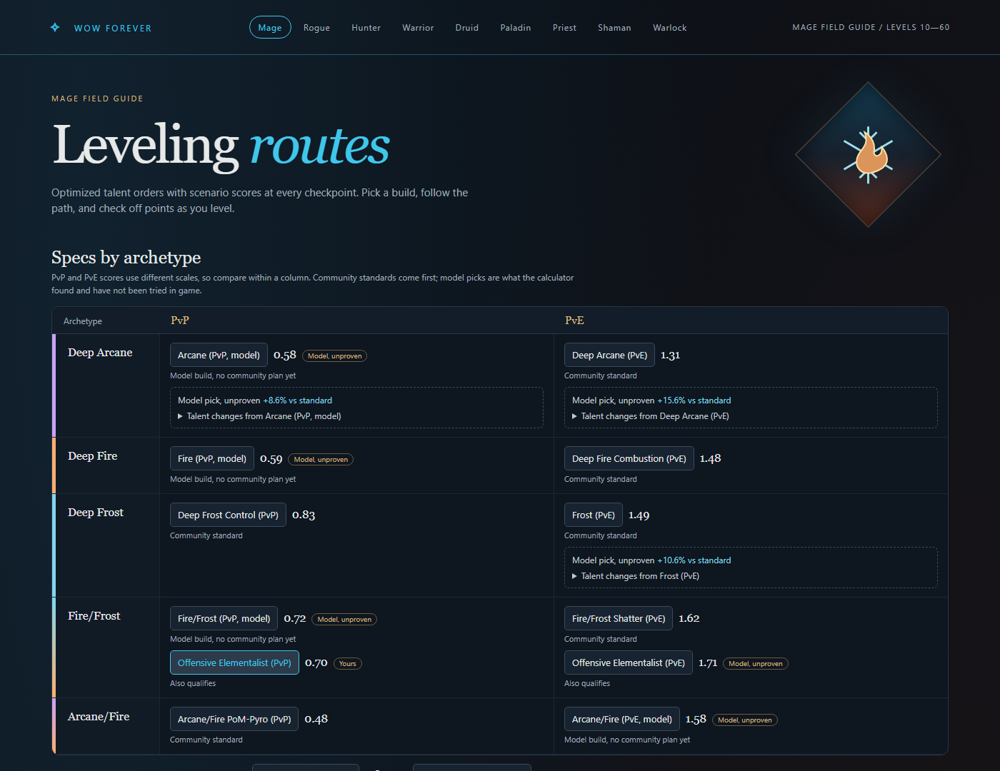
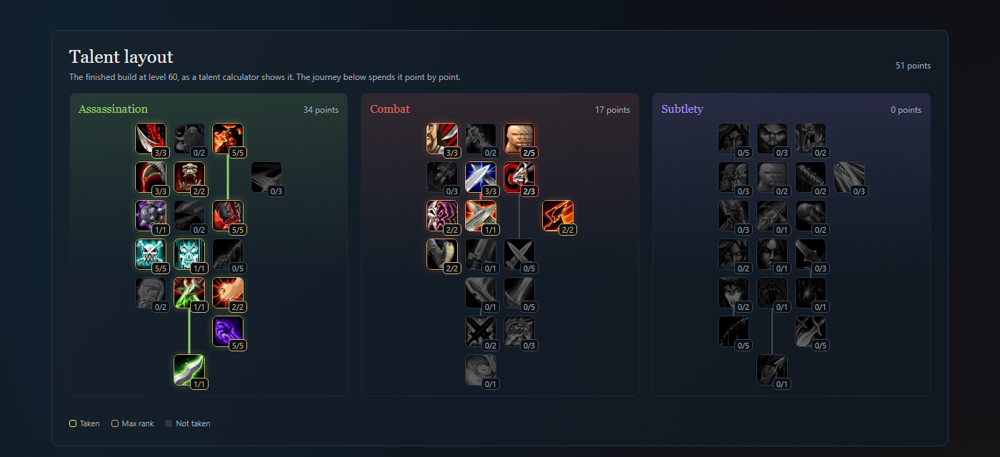
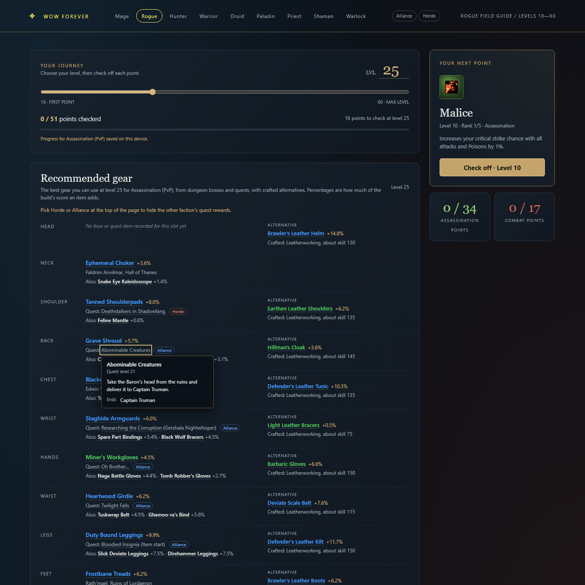

# wowforever-helper

Talent builds, leveling routes and build scoring for **World of Warcraft: Forever**, Blizzard's reimagined
Classic. It reads the game client's own talent and spell data, collects the builds the community actually
plays, and scores them for PvE and PvP with a deterministic model. The result is an offline dashboard
that works for all nine classes.



> **Fan project, beta data.** WoW Forever is in beta and changes weekly. Talent trees come straight from
> the client and are current to the listed build. Scores come from a model with stated assumptions, not
> from playtesting. Builds marked *model* have no community plan behind them yet.

## What you get

- **Every class and spec:** a matrix of each talent tree (plus the common hybrids) for PvP and PvE.
  Each slot holds the community standard, or a clearly labeled model build where no community plan exists.
- **Leveling routes:** a legal point-by-point order for every build from level 10 to 60, with a level
  slider, check-off progress saved in your browser, and the next point to take.
- **Talent layout:** the finished build shown the way a talent calculator draws it.
- **Recommended gear by level:** as you move through the journey, the best gear your class can use at
  that level for the selected build, from dungeon bosses and quests, with crafted alternatives. Each item
  shows its source, and quest rewards are marked Alliance or Horde (pick yours at the top of the page).
  Where the source site has no faction for a quest, it is worked out from the quest giver or the places
  it names (hover over the tag for the reason). If you know a quest giver's faction, add it to `config/quest_factions.toml`.
  Hover over (or tap) an item for its stats, or a quest for where it starts and ends and its chain.
- **Scores:**
  - PvE: questing kills per hour, dungeon and raid DPS.
  - PvP: an expected-value duel model against real class opponents.
  - Each comes with a model pick that beats the standard where the calculator finds one.
- **Per-class look:** official class icons, in-game class colors, tree colors and real talent icons, working on desktop and phone.





## Quick start

Download `index.html` from the latest [release](https://github.com/alsh0083/wowforever-helper/releases)
(or take `dashboard/index.html` from this repository) and open it in a browser. It's a single offline
file with the data built in, so nothing needs installing.

### Rebuilding it yourself (optional)

Only needed to change builds or assumptions, or to pick up a new game build before a release does
(Python 3.12+):

```sh
python -m venv .venv
.venv/Scripts/python -m pip install -e ".[dev]"     # Windows; use .venv/bin/python elsewhere
.venv/Scripts/python -m pytest                      # the test suite, offline

# score every class and rebuild the page
.venv/Scripts/python -m wowforever report --dataset data/datasets/1.60.1.70205.json --class mage --out data/report.json
.venv/Scripts/python -m wowforever report --dataset data/datasets/1.60.1.70205.json --class rogue --out data/report-rogue.json
.venv/Scripts/python -m wowforever dashboard        # writes dashboard/index.html
```

## Commands

| Command | What it does |
|---|---|
| `wowforever update` | On-demand patch check: finds the latest build (wago.tools API), reads the client tables from the local cache, fetches the wowforevertalent.com pages, diffs against the saved dataset and records changes in `data/CHANGELOG.md`. For a new build it lists the table CSVs to save from wago.tools in a browser first |
| `wowforever report --class <class>` | Scores every build of a class and writes the dashboard payload |
| `wowforever dashboard` | Renders `dashboard/index.html` from all reports |
| `wowforever gear-stats --class <class>` | Rebuilds a class's per-level stat table from real Forever items |
| `wowforever gear-sources [--refresh]` | Rebuilds `data/items/gear.json` (where gear comes from); `--refresh` fetches wowforevertalent.com's item, dungeon and quest pages first |
| `wowforever import-logs <file.har>` | Summarizes Forever Logs pages you saved from your browser (no fetching) |
| `wowforever validate-logs` | Compares the model's dungeon DPS with Forever Logs statistics per class and spec |

There are no scheduled jobs. Every network call happens only when you run `update` or one of the tools.

## How the scores work

- **Talent data** comes from the client's Trait tables (`src/wowforever/classes/<class>.py` maps each tree's
  grid). Rank text and icons come from wowforevertalent.com. Every talent is either modeled through effect
  rules read from its rank text, or listed with the reason it isn't.
- **Damage engines:**
  - **Spell casters** (mage, priest, warlock, Balance druid, Elemental shaman): expected damage per cast with
    Classic hit, crit and mana rules, with DoTs kept up and cooldowns used.
  - **Melee and ranged** (rogue, hunter, warrior, Retribution paladin, Feral cat, Enhancement shaman):
    the Classic attack table, weapons from real gear, and each class's resource (energy, Rage, mana).
- **Stats** come from the best real Forever gear at each level on top of estimated base stats
  (`config/stats/`).
- **PvP** is a duel model of kill speed, lockouts (with diminishing returns), kiting and armor against
  18 real-talent opponent kits.
- **Healers and tanks** have routes but no scores (there's no healing or threat model yet).
- **Reality check:** `validate-logs` compares the model with real beta parses. Ranged and caster DPS track
  the logs closely. Melee and some low-level casters are off by known reasons
  ([#172](https://github.com/alsh0083/wowforever-helper/issues/172)).

Each class's caveats (what isn't modeled yet) are shown on its dashboard page and live in its module.
Assumptions and their sources are in `config/` and `docs/research/`.

## Data sources and attribution

- **[wowforevertalent.com](https://wowforevertalent.com/)**: talent rank text, icons, calculator popularity
  and the build catalog, under Creative Commons Attribution. Raw page snapshots are kept unmodified under
  `data/raw/wowforevertalent/`.
- **[wago.tools](https://wago.tools/)**: DB2 exports of the WoW Forever client (talent trees, spells, items).
- **[Forever Logs](https://foreverlogs.gg/)**: combat-log statistics through its
  [official public API](https://foreverlogs.gg/docs/api), used to check the damage models. Bring your own
  free key (`FOREVERLOGS_API_KEY` in `.env`). Responses are cached locally and not redistributed.
- **Community guides and forums** cited per build and per assumption in `config/consensus.toml`.

Sources are used through their published APIs or where robots.txt allows, and never otherwise:
wago.tools' table CSVs aren't in its published API, so the tool doesn't download them; you save them
in a browser when a new game build arrives (`update` lists the links). Gold, boosting and carry
sellers are excluded. See `docs/research/data-sources.md`.

World of Warcraft, WoW Forever and related names and game icons are trademarks or property of Blizzard
Entertainment. This project isn't affiliated with or endorsed by Blizzard.

## Project layout

- `src/wowforever/`: the package; per-class knowledge in `classes/`, the engines in `caster.py`,
  `physical.py`, `melee_scenarios.py` and `pvp/`
- `config/`: builds (`builds/`), stat tables, scenario parameters, opponent kits and sourced assumptions
- `data/`: datasets per game build, popularity snapshots, reports, the changelog of game changes
- `dashboard/`: the template and the generated offline page
- `tools/`: import and derivation scripts (build catalog, model builds, opponent kits, fixtures)
- `tests/`: the pytest suite; tests use saved fixtures and never touch the network
- `docs/`: research notes, design notes, planning rounds and task specs

## Contributing

Issues and pull requests are welcome. Corrections from people playing the beta are the most valuable:
- a talent that behaves differently from its rank text
- a community build that's missing
- a score that doesn't match what you see in game

Work is tracked in [issues](https://github.com/alsh0083/wowforever-helper/issues) by
[milestone](https://github.com/alsh0083/wowforever-helper/milestones). Please run the test suite before
opening a PR.

## License

[MIT](LICENSE). Game data, talent text and icons belong to their owners (see above).
